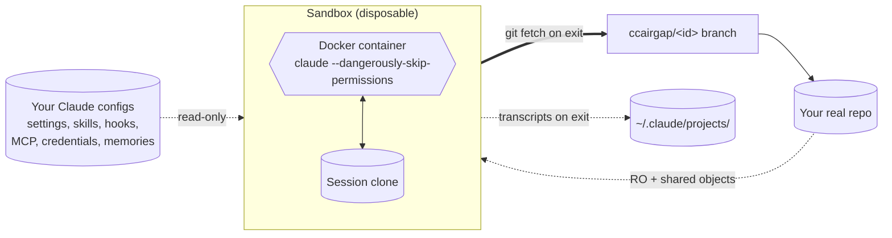

<div align="center">

# ccairgap


[](https://github.com/alfredvc/ccairgap/actions/workflows/ci.yml)
[](https://www.npmjs.com/package/ccairgap)
[](LICENSE)

</div>

**A sandbox for Claude Code that just works.**

Same config, skills, hooks, and MCP servers as on your host. Full permissions inside. Launches in seconds, even on huge repos. Work lands as new git branches in your repo on exit.

- **Full permissions, contained** — host filesystem physically out of reach.
- **Your Claude** — config, skills, hooks, and MCP servers all inherited.
- **Work lands as branches** — nothing lost if you walk away.
- **Fast on large repos** — shared clone, no full copy.
- **Opt-in hooks and MCP** — disabled by default; enable by glob.
- **Resume any session** — start on host or sandbox, continue on either.
- **Clipboard passthrough** — copy an image on your host, paste it into Claude inside the sandbox. macOS, Linux (Wayland/X11), and WSL2.

## Why ccairgap?

**vs. running `claude --dangerously-skip-permissions` on your host.** One bad tool call — or one prompt-injected instruction — can touch any file your user account can. ccairgap constrains the writable surface physically: not by rules, but by not mounting those paths.

**vs. using Claude with permission prompts.** Prompts are tedious to babysit, blanket rules risk over-permissioning, and precise rules are hard to write. ccairgap skips the permission layer entirely — the sandbox itself is the layer.

**vs. other Claude sandbox tools.** Most give you a stripped-down Claude. ccairgap gives you yours — fully configured, exactly as it runs on your host.

## Setup

```bash
npm i -g ccairgap
```

**Requirements:** Node ≥ 20, Docker, `git`, and `rsync` on PATH. macOS, Linux, and Windows/WSL2.

**Login:** Run `claude` once on the host — ccairgap inherits the credentials automatically.

**First launch:** Builds the container image (~1–2 min, one-time). Every launch after is seconds.

## Quick start

Run inside any git repo:

```bash
ccairgap
```

Claude opens at your repo root, work as normal. When you're done, exit claude and any committed changes appear in your repository as a new branch `ccairgap/<id>`.

The sandboxed Claude has:
- Your CLAUDE.md, both project and global
- Your skills from: project, global, inside plugins
- Your memories (read-only)
- Host clipboard images
- Your hooks (may require adjusting your dockerfile)
- Your MCP servers (likely requires adjusting your dockerfile)
- Your managed-policy settings (enterprise / MDM; skipped when absent)

### Common setups

```bash
# Read-only sibling (e.g. node_modules)
ccairgap --ro node_modules

# Two repos: primary workspace + readable sibling
ccairgap --repo ~/src/foo --extra-repo ~/src/bar

# Hand it a task and walk away
ccairgap -p "add login flow"

# Resume a session — UUID or the session name claude prints on exit
ccairgap -r 01234567-89ab-cdef-0123-456789abcdef
ccairgap -r 'Refactor login flow'

# Resume a ccairgap-started session on host
claude --resume 01234567-89ab-cdef-0123-456789abcdef
```

## Agent Skills

```bash
npx skills add alfredvc/ccairgap
```

## How it works

Claude runs inside a Docker container with full permissions, but the container can barely see your machine. Your real repo is mounted read-only; wherever the container wants to write, it writes into a lightweight throwaway clone of your repo that shares objects with the original without touching it. When Claude exits, ccairgap runs `git fetch` on the host, pulling whatever committed work the container produced back into your real repo as a fresh `ccairgap/<id>` branch. Nothing else lands anywhere.



Your `~/.claude/` — settings, plugins, skills, commands, CLAUDE.md, credentials — is mounted read-only and copied in at startup, so inside the container Claude looks and behaves exactly like yours. Project-scope Claude config comes along too, including uncommitted files like `settings.local.json` with your MCP approvals and permission allow-lists. Transcripts written during the session land back in `~/.claude/projects/` on exit, so `claude --resume` on the host keeps working.

Hooks and MCP servers are disabled by default, because most of them reach for host binaries the container doesn't ship. Opt them in by glob — and if a binary is missing, extend the provided Dockerfile. Your real settings are never edited; the filter runs on copies.

On exit, if Claude committed, you get a branch. If it committed to a side branch or left uncommitted work behind, ccairgap preserves the session dir so you can recover it. If it did nothing, nothing changes.

Clipboard passthrough — paste images from your host into Claude inside the sandbox — is on by default on macOS, Linux, and WSL2.

Full design: [docs/SPEC.md](docs/SPEC.md).

## Reference

- [Launch flags](docs/flags.md)
- [Subcommands](docs/subcommands.md)
- [Host environment variables](docs/env-vars.md)
- [Configuration file](docs/config.md)
- [`.ccairgap/` — ccairgap-scope Claude config](docs/ccairgap-dir.md)
- [Forwarding flags to claude](docs/claude-args.md)
- [Hooks](docs/hooks.md)
- [MCP servers](docs/mcp.md)
- [Auth refresh](docs/auth-refresh.md)
- [Raw docker run args & secrets](docs/docker-run-args.md)
- [Custom Dockerfile](docs/dockerfile.md)
- [Clipboard passthrough](docs/clipboard.md)
- [Auto-memory](docs/auto-memory.md)
- [Managed policy (MDM)](docs/managed-policy.md)
- [Full design spec](docs/SPEC.md)

## Development

```bash
npm install
npm run typecheck
npm test
npm run build   # bundles to dist/cli.js via tsup
```

## Contributing

Bug reports and pull requests welcome. Open an issue first for non-trivial changes.

## License

MIT.
