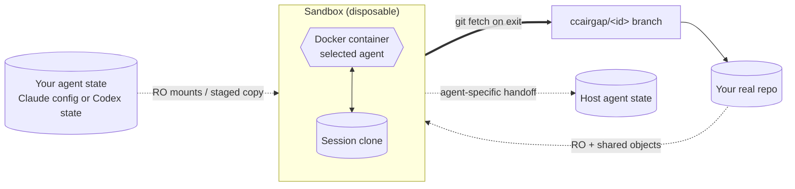

<div align="center">

# ccairgap


[](https://github.com/alfredvc/ccairgap/actions/workflows/ci.yml)
[](https://www.npmjs.com/package/ccairgap)
[](LICENSE)

</div>

**A sandbox for Claude Code and Codex CLI that just works.**

Run Claude Code by default, or opt into Codex CLI with `--agent codex`. The selected agent gets full permissions inside a Docker sandbox while your host filesystem stays physically out of reach. Launches in seconds, even on huge repos. Work lands as new git branches in your repo on exit.

- **Full permissions, contained** — host filesystem physically out of reach.
- **Your selected agent** — Claude config and Codex state are staged from your host with agent-specific policy filtering.
- **Credentials safe** — Claude refresh tokens never enter the container; Codex auth is sanitized into session-local state.
- **Work lands as branches** — nothing lost if you walk away.
- **Fast on large repos** — shared clone, no full copy.
- **Opt-in hooks and MCP** — disabled by default; enable by glob for the selected agent.
- **Per-repo config** — drop `.ccairgap/` at your repo root for ccairgap launch config and Claude-scoped overlays; Codex uses native Codex project guidance.
- **Claude resume support** — start a Claude session on host or sandbox, continue on either.
- **Clipboard passthrough** — copy an image on your host, paste it into Claude inside the sandbox. macOS, Linux (Wayland/X11), and WSL2.
- **Works behind corp proxies** — `NODE_EXTRA_CA_CERTS` forwards through, so custom CA bundles just work.

## Why ccairgap?

**vs. running an unsafe agent on your host.** One bad tool call — or one prompt-injected instruction — can touch any file your user account can. ccairgap constrains the writable surface physically: not by rules, but by not mounting those paths.

**vs. using agent permission prompts.** Prompts are tedious to babysit, blanket rules risk over-permissioning, and precise rules are hard to write. ccairgap skips the permission layer entirely — the sandbox itself is the layer.

**vs. vendor-generic containers.** Anthropic's reference devcontainer and Docker AI Sandboxes hand you an empty `~/.claude/` — re-auth inside, and your skills, hooks, MCP servers, and plugins don't come along. For Claude, ccairgap mirrors your host config read-only, strips the refresh token before any creds enter the container, and lets `claude --resume` on the host pick up whatever the sandbox produced. For Codex, ccairgap prepares a sanitized session-local `CODEX_HOME` instead of bind-mounting your host Codex state directly.

## Setup

```bash
npm i -g ccairgap
```

**Requirements:** Node ≥ 20, Docker, `git`, and `rsync` on PATH. macOS, Linux, and Windows/WSL2.

**Claude login:** Run `claude` once on the host — ccairgap inherits the credentials automatically.

**Codex login:** Run `codex login` once on the host, or provide `CODEX_API_KEY` for Codex print mode. Codex launches read `$CODEX_HOME` (default `~/.codex`) and copy only sanitized session-local state into the container.

**First launch:** Pulls a pre-built container image from GitHub Container Registry (`ghcr.io/alfredvc/ccairgap`) — usually ~10–30s on a decent connection. Falls back to local build (~1–2 min) when offline, when `--dockerfile` is set, or when the published image isn't available for your CLI version. Subsequent launches are seconds.

**Tab completion (optional):** `ccairgap install-completion` (bash/zsh/fish). Full reference: [docs/completion.md](docs/completion.md).

**Agent selection:** Claude is the default. `--agent codex` and `agent: codex` opt into Codex CLI inside the same ccairgap sandbox. Codex launches require a workspace repo and use sanitized session-local Codex state. Full details: [docs/codex.md](docs/codex.md).

## Quick start

Run inside any git repo:

```bash
ccairgap
```

Claude opens at your repo root by default. When you're done, exit the agent and any committed changes appear in your repository as a new branch `ccairgap/<id>`.

With Claude selected, the sandbox has:
- Your CLAUDE.md, both project and global
- Your skills from: project, global, inside plugins
- Your memories (read-only)
- Host clipboard images
- Your hooks (may need a [custom Dockerfile](docs/dockerfile.md) if hooks shell out to host binaries)
- Your MCP servers (usually needs a [custom Dockerfile](docs/dockerfile.md) to install the server binaries)
- Your managed-policy settings (enterprise / MDM; skipped when absent)

With Codex selected, the sandbox has:
- Sanitized host `$CODEX_HOME` config and auth
- Project guidance from `AGENTS.md`, `AGENTS.override.md`, `.codex/`, and `.agents/` surfaces
- Codex hooks and MCP filtered behind the same explicit enable policy
- Session-local Codex history and rollout state, with validated rollout records copied back on handoff

### Common setups

```bash
# Read-only sibling (e.g. node_modules)
ccairgap --ro node_modules

# Two repos: primary workspace + readable sibling
ccairgap --repo ~/src/foo --extra-repo ~/src/bar

# Hand it a task and walk away
ccairgap -p "add login flow"

# Use Codex instead of Claude
ccairgap --agent codex --repo .

# Resume a Claude session — UUID or the session name claude prints on exit
ccairgap -r 01234567-89ab-cdef-0123-456789abcdef
ccairgap -r 'Refactor login flow'

# Resume a ccairgap-started session on host
claude --resume 01234567-89ab-cdef-0123-456789abcdef
```

### When things go wrong

If the selected agent leaves uncommitted work behind, the container crashes, or you `kill -9` the CLI, ccairgap preserves the session dir on disk so nothing is lost.

```bash
# See preserved sessions
ccairgap list

# Re-run handoff: fetch the sandbox branch, copy transcripts, clean up
ccairgap recover <id>

# Throw a preserved session away without recovering
ccairgap discard <id>
```

Full subcommand reference: [docs/subcommands.md](docs/subcommands.md).

## Agent Skills

Install the `ccairgap-configure` skill so Claude (on your host) can set up ccairgap for a new project — detect which host binaries the workflow needs, generate a small extension `Dockerfile`, and write `.ccairgap/config.yaml` with the right `--ro`, hook, and MCP entries.

```bash
npx skills add alfredvc/ccairgap
```

Then in Claude: *"configure ccairgap for this repo"*. Source: [`skills/ccairgap-configure/`](skills/ccairgap-configure).

## User-wide config

Persistent defaults that apply across all projects. Scaffold with:

```bash
ccairgap init --user
```

Config dir: `~/.config/ccairgap/` (or `$XDG_CONFIG_HOME/ccairgap/`).

**File vocabulary:**

| Path | Role |
|---|---|
| `config.yaml` | Defaults for every launch — all `config.yaml` keys accepted; relative `repo`/`ro`/etc. are a hard error (no workspace anchor). |
| `integrations/*.yaml` | Per-tool drop-ins; allowlisted keys only: `hooks.enable`, `mcp.enable`, `docker-run-arg` (safe-flag subset). |
| `CLAUDE.md` | Claude overlay: appended to in-container `~/.claude/CLAUDE.md` before the project block. |
| `settings.json` | Claude overlay: deep-merged into `~/.claude/settings.json`. |
| `mcp.json` | Claude overlay: `mcpServers` merged into `~/.claude.json`. |
| `skills/` | Claude overlay: rsynced into `~/.claude/skills/`. |
| `Dockerfile` | Opt-in custom image sidecar (`dockerfile: Dockerfile` in `config.yaml`). |

**Layer order:** defaults < user-wide integrations < user-wide config < project < CLI

Integration drop-ins let third-party tools self-register hooks, MCP servers, or safe docker args without touching the user's `config.yaml`.

**Hermetic overrides:**
- `--no-user-config` — skip the entire user-wide layer (launch config + session environment).
- `--bare` — skip user-wide and project launch config (session environment still injected).

Full spec: [docs/config.md — User-wide config](docs/config.md#user-wide-config).

## How it works

The selected agent runs inside a Docker container with full permissions, but the container can barely see your machine. Your real repo is mounted read-only; wherever the container wants to write, it writes into a lightweight throwaway clone of your repo that shares objects with the original without touching it. When the agent exits, ccairgap runs `git fetch` on the host, pulling whatever committed work the container produced back into your real repo as a fresh `ccairgap/<id>` branch. Nothing else lands anywhere.



For Claude, your `~/.claude/` — settings, plugins, skills, commands, CLAUDE.md, credentials — is mounted read-only and copied in at startup, so inside the container Claude looks and behaves exactly like yours. Project-scope Claude config comes along too, including uncommitted files like `settings.local.json` with your MCP approvals and permission allow-lists. Transcripts written during the session land back in `~/.claude/projects/` on exit, so `claude --resume` on the host keeps working.

For Codex, ccairgap resolves `$CODEX_HOME`, filters config, sanitizes auth, overlays safe project guidance, and writes a session-local `CODEX_HOME` for the container. Runtime Codex auth, logs, history, memories, plugin state, and marketplace state stay inside the session; validated rollout records are copied back during handoff or `recover`.

Hooks and MCP servers are disabled by default, because most of them reach for host binaries the container doesn't ship. Opt them in by glob — and if a binary is missing, extend the provided Dockerfile. Your real settings are never edited; the filter runs on copies.

On exit, if the selected agent committed, you get a branch. If it committed to a side branch or left uncommitted work behind, ccairgap preserves the session dir so you can recover it. If it did nothing, nothing changes.

Clipboard passthrough — paste images from your host into Claude inside the sandbox — is on by default on macOS, Linux, and WSL2.

Full design: [docs/SPEC.md](docs/SPEC.md).

## Reference

**Launch**
- [Launch flags](docs/flags.md)
- [Subcommands](docs/subcommands.md)
- [Shell completion](docs/completion.md)
- [Host environment variables](docs/env-vars.md)
- [Codex support](docs/codex.md)
- [Forwarding flags to the selected agent](docs/claude-args.md)

**Config**
- [Configuration file](docs/config.md)
- [`.ccairgap/` — ccairgap-scope Claude config](docs/ccairgap-dir.md)
- [User-wide config](docs/config.md#user-wide-config)

**Integrations**
- [Hooks](docs/hooks.md)
- [MCP servers](docs/mcp.md)
- [Clipboard passthrough](docs/clipboard.md)
- [Auto-memory](docs/auto-memory.md)
- [Managed policy (MDM)](docs/managed-policy.md)

**Advanced**
- [Auth refresh](docs/auth-refresh.md)
- [Custom Dockerfile](docs/dockerfile.md)
- [Raw docker run args & secrets](docs/docker-run-args.md)

**Design**
- [Full design spec](docs/SPEC.md)

## Development

```bash
npm install
npm run typecheck
npm test
npm run build   # bundles to dist/cli.js via tsup
```

## Contributing

Bug reports and pull requests welcome. Open an issue first for non-trivial changes.

## License

MIT.
